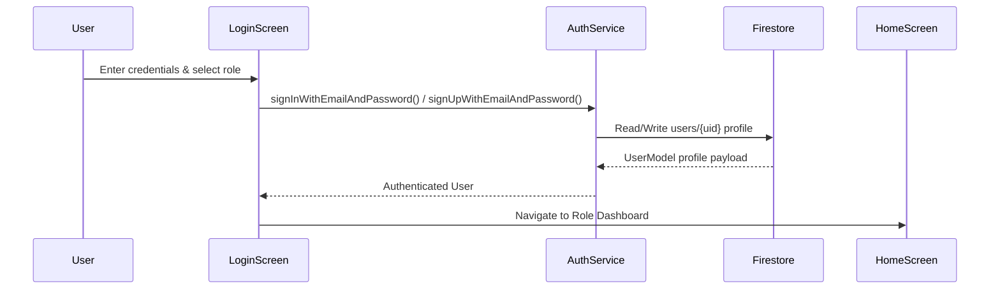

# FARMIGO System Architecture Document

## 1. Overview
FARMIGO is a unified digital agriculture platform designed to connect farmers, landowners, agricultural workers, machinery providers, consultants, produce buyers/sellers, and agricultural authorities.

This document outlines the architecture, data models, shared services, and security principles for the FARMIGO codebase.

---

## 2. Flutter Application Architecture

FARMIGO follows a **Feature-First Clean Architecture** pattern designed for scalability and parallel team collaboration.

```text
lib/
├── main.dart                          # Application entrypoint & Firebase initialization
├── firebase_options.dart              # Generated Firebase configuration
├── core/                              # Core foundation & shared utilities
│   ├── constants/                     # Color tokens, string constants, Firestore collections
│   ├── errors/                        # AppException mapped error handling
│   ├── routes/                        # Central route table (AppRoutes)
│   ├── services/                      # Shared Firebase & storage services
│   ├── theme/                         # Material 3 dark/light themes
│   └── utils/                         # TimestampHelper & formatters
├── models/                            # Shared strongly typed Firestore data models
├── features/                          # Feature modules
│   ├── auth/                          # Authentication & User Management
│   ├── home/                          # Dashboard & Role Navigation
│   ├── land/                          # Land Leasing & Requests
│   ├── machinery/                     # Machinery Rental & Requests
│   ├── workers/                       # Farm Workforce Directory
│   ├── marketplace/                   # Produce Marketplace & Orders
│   ├── consultants/                   # Expert Advisory & Consultations
│   ├── agriculture/                   # Smart Ag Updates & Scheme Alerts
│   └── notifications/                 # Notifications Center
└── widgets/                           # Reusable UI widgets (AppLogo, CustomButton, etc.)
```

---

## 3. Firebase Backend Architecture

- **Firebase Authentication**: Email/Password authentication storing user UID as primary identity token.
- **Cloud Firestore**: NoSQL relational database using 12 specialized collections.
- **Firebase Storage**: Object storage for user avatars, land photos, machinery photos, and marketplace product media using strict path isolation (`<category>/<uid>/<file>`).

---

## 4. Authentication & Role-Based Navigation Flow



Supported Stakeholder Roles (`UserRole`):
- `farmer`: Farmers requesting land, machinery, workforce, or advisory.
- `landowner`: Landowners listing parcels for lease.
- `worker`: Farm workers offering labor skills.
- `machineryProvider`: Owners offering tractors & equipment.
- `consultant`: Agronomists & crop specialists providing advice.
- `marketplaceBuyer`: Buyers purchasing produce.
- `marketplaceSeller`: Farmers/vendors selling produce.

---

## 5. Firestore Collections & Model Definitions

| Collection | Model Class | Document ID Strategy | Primary Ownership Field |
| :--- | :--- | :--- | :--- |
| `users` | [`UserModel`](file:///Users/sruthis/Desktop/Farmigo/Farmigooo/lib/models/user_model.dart) | Firebase Auth `uid` | `id` |
| `lands` | [`LandModel`](file:///Users/sruthis/Desktop/Farmigo/Farmigooo/lib/models/land_model.dart) | Auto-generated ID | `ownerId` |
| `land_requests` | [`LandRequestModel`](file:///Users/sruthis/Desktop/Farmigo/Farmigooo/lib/models/land_request_model.dart) | Auto-generated ID | `farmerId` / `ownerId` |
| `workers` | [`WorkerModel`](file:///Users/sruthis/Desktop/Farmigo/Farmigooo/lib/models/worker_model.dart) | Auto-generated ID | `userId` |
| `machinery` | [`MachineryModel`](file:///Users/sruthis/Desktop/Farmigo/Farmigooo/lib/models/machinery_model.dart) | Auto-generated ID | `ownerId` |
| `machinery_requests` | [`MachineryRequestModel`](file:///Users/sruthis/Desktop/Farmigo/Farmigooo/lib/models/machinery_request_model.dart) | Auto-generated ID | `requesterId` / `ownerId` |
| `products` | [`ProductModel`](file:///Users/sruthis/Desktop/Farmigo/Farmigooo/lib/models/product_model.dart) | Auto-generated ID | `vendorId` |
| `orders` | [`OrderModel`](file:///Users/sruthis/Desktop/Farmigo/Farmigooo/lib/models/order_model.dart) | Auto-generated ID | `buyerId` / `vendorId` |
| `consultants` | [`ConsultantModel`](file:///Users/sruthis/Desktop/Farmigo/Farmigooo/lib/models/consultant_model.dart) | Auto-generated ID | `userId` |
| `consultations` | [`ConsultationModel`](file:///Users/sruthis/Desktop/Farmigo/Farmigooo/lib/models/consultation_model.dart) | Auto-generated ID | `farmerId` / `consultantId` |
| `agriculture_updates` | [`AgricultureUpdateModel`](file:///Users/sruthis/Desktop/Farmigo/Farmigooo/lib/models/agriculture_update_model.dart) | Auto-generated ID | `authorId` |
| `notifications` | [`NotificationModel`](file:///Users/sruthis/Desktop/Farmigo/Farmigooo/lib/models/notification_model.dart) | Auto-generated ID | `userId` |

---

## 6. Shared Core Services

All feature modules MUST use the shared services layer rather than calling Firebase APIs directly:

1. [`AuthService`](file:///Users/sruthis/Desktop/Farmigo/Farmigooo/lib/core/services/auth_service.dart): Handles sign up, sign in, logout, and current user profile fetching.
2. [`FirestoreService`](file:///Users/sruthis/Desktop/Farmigo/Farmigooo/lib/core/services/firestore_service.dart): Decoupled CRUD operations and query/stream subscriptions.
3. [`StorageService`](file:///Users/sruthis/Desktop/Farmigo/Farmigooo/lib/core/services/storage_service.dart): Image upload, URL resolution, and deletion in Firebase Storage.
4. [`NotificationService`](file:///Users/sruthis/Desktop/Farmigo/Farmigooo/lib/core/services/notification_service.dart): System & event notification persistence and stream delivery.

---

## 7. Storage Structure

Firebase Storage enforces path isolation based on user UID:
- User avatars: `users/{uid}/{filename}`
- Land images: `lands/{uid}/{filename}`
- Machinery images: `machinery/{uid}/{filename}`
- Product images: `products/{uid}/{filename}`
- Agriculture update images: `updates/{uid}/{filename}`

---

## 8. Security Principles

1. **Authentication Requirement**: All read/write access requires a valid Firebase Auth user token (`request.auth != null`).
2. **Immutable Role Protection**: Normal clients cannot modify their `id`, `role`, or `verified` status.
3. **Strict Path Ownership**: Users can only modify records where their UID matches the ownership field (`ownerId`, `vendorId`, `userId`, `farmerId`, etc.).
