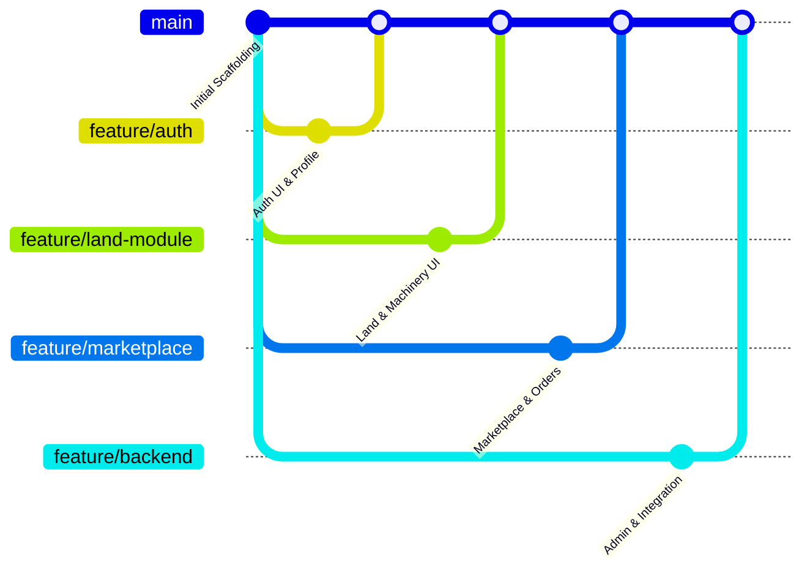

# FARMIGO Team Development & Governance Guidelines

This document defines team responsibilities, shared architectural rules, Git workflows, and data ownership protocols for parallel development by a 4-person development team.

---

## 1. Team Responsibilities Breakdown

### PERSON 1 — Authentication & User Module
- **Responsibilities**:
  - Login & Sign-Up UI polish and error state handling.
  - Multi-stakeholder role selection UI.
  - User profile management & edit screens.
  - Verification & identity status UI.
  - Role-customized user home dashboards.
- **Primary Collection**:
  - `users`
- **Primary Feature Directory**:
  - `lib/features/auth/`
  - `lib/features/home/`

---

### PERSON 2 — Land, Worker & Machinery Module
- **Responsibilities**:
  - Land listing creation, search, and parcel details screens.
  - Land lease request submission & landlord approval UI.
  - Farm workforce directory & worker booking screens.
  - Heavy machinery & tractor rental listings.
  - Machinery rental booking requests.
- **Primary Collections**:
  - `lands`
  - `land_requests`
  - `workers`
  - `machinery`
  - `machinery_requests`
- **Primary Feature Directories**:
  - `lib/features/land/`
  - `lib/features/workers/`
  - `lib/features/machinery/`

---

### PERSON 3 — Marketplace, Consultant & Agriculture Information
- **Responsibilities**:
  - Produce marketplace product catalog & seller listing creation.
  - Buyer shopping cart & order checkout UI.
  - Order status tracking & vendor order management.
  - Agronomist & expert consultant directory.
  - Consultation appointment booking.
  - Agriculture news, disease alerts, and government scheme feed.
- **Primary Collections**:
  - `products`
  - `orders`
  - `consultants`
  - `consultations`
  - `agriculture_updates`
- **Primary Feature Directories**:
  - `lib/features/marketplace/`
  - `lib/features/consultants/`
  - `lib/features/agriculture/`

---

### PERSON 4 — Firebase Backend, Integration & Admin
- **Responsibilities**:
  - Firebase infrastructure, security rules (`firestore.rules`, `storage.rules`), and indexing.
  - Maintaining shared services (`AuthService`, `FirestoreService`, `StorageService`, `NotificationService`).
  - Cross-module notifications center & event triggers.
  - CI/CD integration, widget tests, and regression testing.
  - Admin & agricultural authority dashboard functionality.
  - Resolving cross-module merge conflicts & integration issues.
- **Primary Collections**:
  - `notifications`
  - Shared infrastructure & administration logic.
- **Primary Directories**:
  - `lib/core/`
  - `lib/models/`
  - `lib/features/notifications/`

---

## 2. Shared Development Rules

All team members MUST strictly adhere to the following rules:

1. **Single Firebase Project**: Use only the configured Firebase project (`farmigooo`). Never create separate local or personal Firebase projects.
2. **Reuse Shared Models**: Use pre-built models under `lib/models/`. Do NOT create duplicate or conflicting data model classes.
3. **Use Shared Services**: Do NOT instantiate raw `FirebaseFirestore` or `FirebaseAuth` directly inside UI screens. Use `AuthService`, `FirestoreService`, `StorageService`, and `NotificationService`.
4. **UID-Based User Identity**: Always reference users via `request.auth.uid` or model UID fields (`ownerId`, `vendorId`, `farmerId`). Never use email strings as primary database keys.
5. **No Fake Data**: Do not hardcode dummy agricultural records or fake listings into the codebase or database.
6. **No Scope Creep**: Do not modify another team member's feature directory without prior coordination.
7. **Use Collection Constants**: Use `FirestoreCollections.<name>` constants. Do NOT hardcode collection string literals.

---

## 3. Git Workflow & Branching Strategy

To avoid direct conflicts on the `main` branch, all development follows a feature-branch PR workflow.



### Workflow Steps:

1. **Pull Latest Main**:
   ```bash
   git checkout main
   git pull origin main
   ```

2. **Create a Feature Branch**:
   - Person 1: `git checkout -b feature/auth`
   - Person 2: `git checkout -b feature/land-module`
   - Person 3: `git checkout -b feature/marketplace`
   - Person 4: `git checkout -b feature/backend`

3. **Commit & Push Local Changes**:
   ```bash
   git add .
   git commit -m "Add land request approval UI"
   git push origin feature/land-module
   ```

4. **Merge via GitHub Pull Request**:
   Open a Pull Request on GitHub to merge your feature branch into `main`. Ensure `flutter analyze` passes clean before merging.

---

## 4. Firestore Data Ownership Matrix

| Collection Name | Primary Owner | Model Class | Ownership Key | Access Controls |
| :--- | :--- | :--- | :--- | :--- |
| `users` | Account Owner | `UserModel` | `id` | Read: Auth Users \| Write: Profile Owner |
| `lands` | Landowner | `LandModel` | `ownerId` | Read: Auth Users \| Write: Land Owner |
| `land_requests` | Farmer & Landowner | `LandRequestModel` | `farmerId` / `ownerId` | Read: Request Participants \| Write: Requester/Owner |
| `workers` | Farm Worker | `WorkerModel` | `userId` | Read: Auth Users \| Write: Worker |
| `machinery` | Machinery Owner | `MachineryModel` | `ownerId` | Read: Auth Users \| Write: Machinery Owner |
| `machinery_requests` | Requester & Owner | `MachineryRequestModel` | `requesterId` / `ownerId` | Read: Request Participants \| Write: Requester/Owner |
| `products` | Produce Vendor | `ProductModel` | `vendorId` | Read: Auth Users \| Write: Vendor |
| `orders` | Buyer & Vendor | `OrderModel` | `buyerId` / `vendorId` | Read: Buyer or Vendor \| Write: Buyer |
| `consultants` | Agri Consultant | `ConsultantModel` | `userId` | Read: Auth Users \| Write: Consultant |
| `consultations` | Farmer & Consultant | `ConsultationModel` | `farmerId` / `consultantId` | Read: Session Participants \| Write: Farmer/Consultant |
| `agriculture_updates` | Admin / Officer | `AgricultureUpdateModel` | `authorId` | Read: Auth Users \| Write: Admin Only |
| `notifications` | Recipient User | `NotificationModel` | `userId` | Read: Recipient User \| Write: Auth Users |
